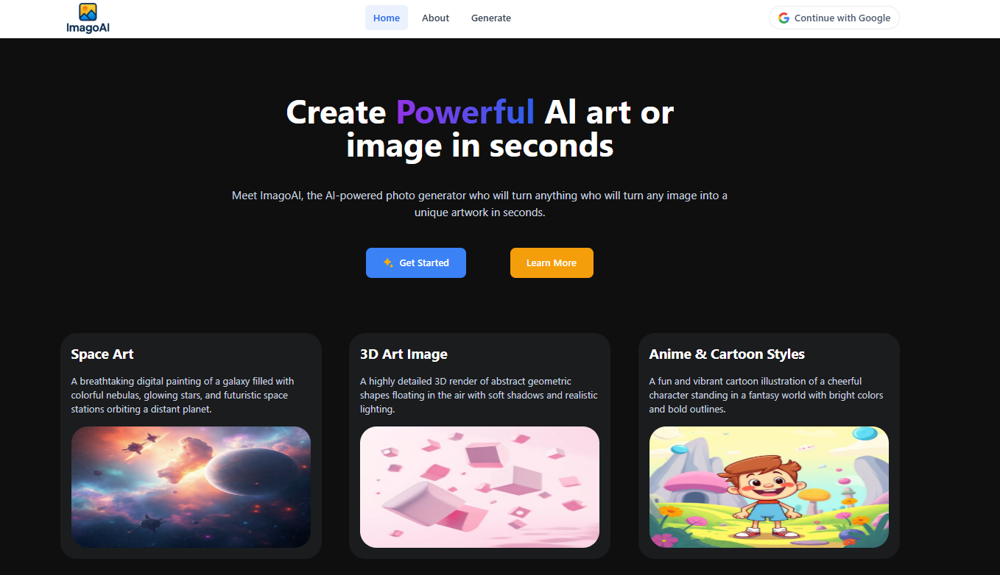
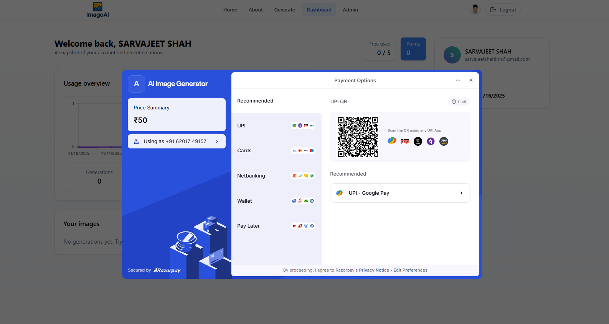
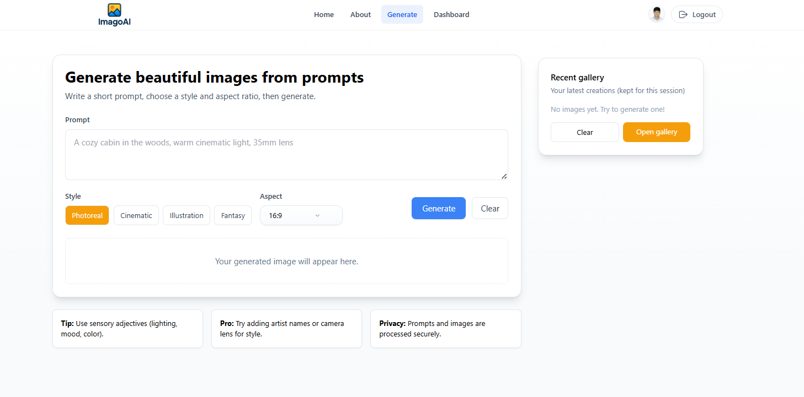
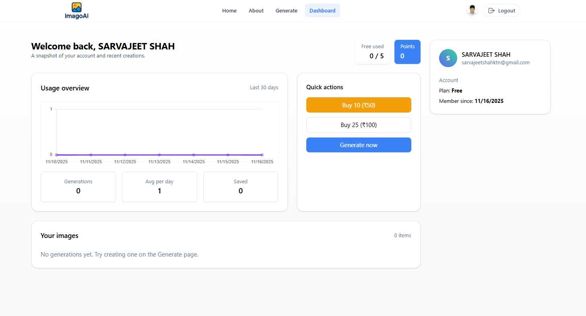
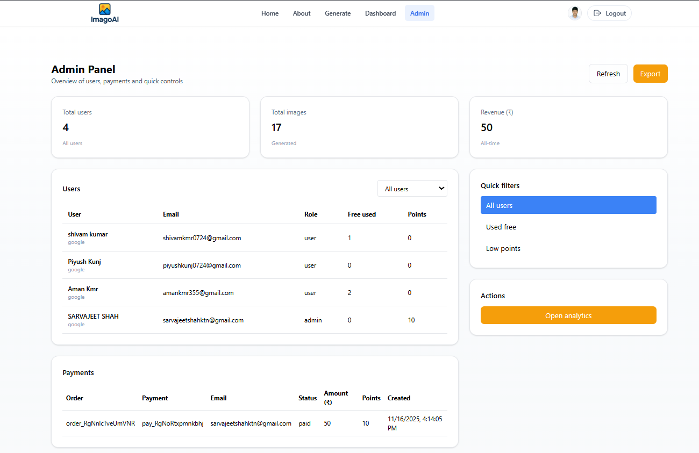
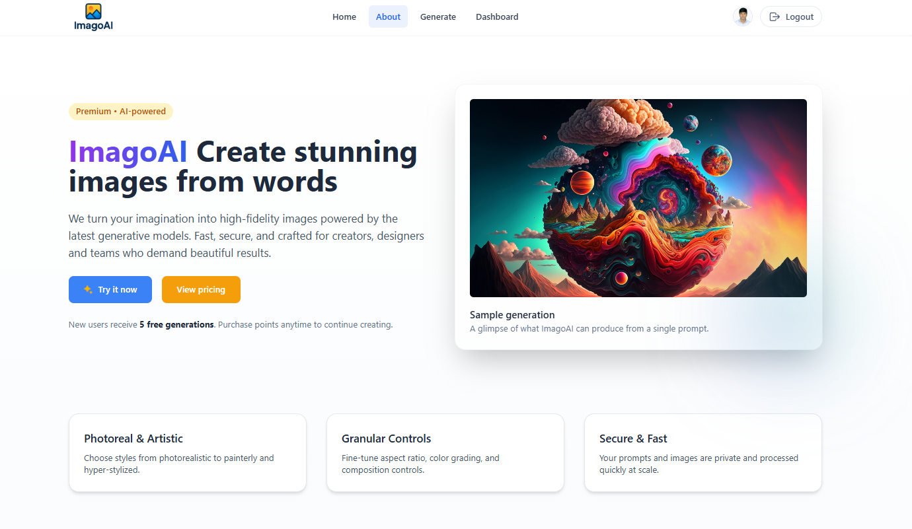

# AI Image Generato

A full-stack MERN (MongoDB, Express.js, React, Node.js) application that leverages the power of AI to generate stunning images based on text prompts. The application includes user authentication, payment integration, and a user-friendly interface for generating and managing AI-generated images.

## 🌐 Live : https://ai-image-generator-1-57f0.onrender.com

## 🌟 Features

- **AI-Powered Image Generation**: Create unique images using advanced AI models
- **User Authentication**: Secure signup and login with JWT and Google OAuth
- **Premium Features**: Unlock advanced features with subscription plans
- **Responsive Design**: Works seamlessly on desktop and mobile devices
- **Image Management**: Save, download, and organize your generated images
- **Admin Dashboard**: Manage users, images, and platform settings
- **Secure Payments**: Integrated with Razorpay for secure transactions
- **Performance Optimized**: Built with modern React and optimized for speed

## 📸 Screenshots

### Home Page



### Razorpay



### Generate Image



### Dashboard



### Admin Dashboard



### About Page



## 🛠 Tech Stack

### Frontend

- **React** - Frontend library
- **Vite** - Build tool and development server
- **Tailwind CSS** - Utility-first CSS framework
- **Framer Motion** - Animation library
- **React Router** - Client-side routing
- **Axios** - HTTP client
- **Chart.js** - Data visualization

### Backend

- **Node.js** - JavaScript runtime
- **Express** - Web application framework
- **MongoDB** - NoSQL database
- **Mongoose** - MongoDB object modeling
- **JWT** - Authentication
- **Passport.js** - Authentication middleware
- **Razorpay** - Payment gateway
- **OpenAI API** - AI image generation

## 🚀 Getting Started

### Prerequisites

- Node.js (v18 or higher)
- npm or yarn
- MongoDB Atlas account or local MongoDB instance
- OpenAI API key
- Razorpay API keys
- Google OAuth credentials

### Installation

1. **Clone the repository**

   ```bash
   git clone https://github.com/yourusername/ai-image-generator.git
   cd ai-image-generator
   ```

2. **Set up the backend**

   ```bash
   cd server
   npm install
   ```

3. **Set up the frontend**
   ```bash
   cd ../client
   npm install
   ```

### Environment Variables

Create a `.env` file in the `server` directory with the following variables:

```env
# Server Configuration
PORT=5000
NODE_ENV=development

# MongoDB
MONGODB_URI=your_mongodb_uri

# JWT
JWT_SECRET=your_jwt_secret
JWT_EXPIRE=30d

# Google OAuth
GOOGLE_CLIENT_ID=your_google_client_id
GOOGLE_CLIENT_SECRET=your_google_client_secret
GOOGLE_CALLBACK_URL=http://localhost:5000/api/auth/google/callback

# ClipDrop
CLIPDROP_API_KEY=your_openai_api_key

# Razorpay
RAZORPAY_KEY_ID=your_razorpay_key_id
RAZORPAY_KEY_SECRET=your_razorpay_key_secret

# Frontend URL (for CORS)
FRONTEND_URL=http://localhost:5173
```

### Running the Application

1. **Start the backend server**

   ```bash
   cd server
   npm run dev
   ```

2. **Start the frontend development server**

   ```bash
   cd client
   npm run dev
   ```

3. Open [http://localhost:5173](http://localhost:5173) in your browser

## 📁 Project Structure

```
ai-image-generator/
├── client/                 # Frontend React application
│   ├── public/             # Static files
│   └── src/
│       ├── components/     # Reusable UI components
│       ├── pages/          # Page components
│       ├── routes/         # Route components
│       ├── App.jsx         # Main App component
│       └── main.jsx        # Entry point
│
└── server/                 # Backend Node.js/Express server
    ├── src/
    │   ├── config/        # Configuration files
    │   ├── controllers/   # Route controllers
    │   ├── middleware/    # Custom middleware
    │   ├── models/        # Database models
    │   ├── routes/        # API routes
    │   ├── services/      # Business logic
    │   └── utils/         # Utility functions
    └── server.js          # Server entry point
```

## 🔧 API Endpoints

### Authentication

- `POST /api/auth/register` - Register a new user
- `POST /api/auth/login` - User login
- `GET /api/auth/google` - Google OAuth authentication
- `GET /api/auth/me` - Get current user profile

### Images

- `POST /api/images/generate` - Generate new AI image
- `GET /api/images` - Get user's generated images
- `GET /api/images/:id` - Get image by ID
- `DELETE /api/images/:id` - Delete an image

### Payments

- `POST /api/payments/create-order` - Create Razorpay order
- `POST /api/payments/verify` - Verify payment
- `GET /api/payments/plans` - Get available subscription plans

### Users

- `GET /api/users` - Get all users (admin only)
- `PUT /api/users/:id` - Update user
- `DELETE /api/users/:id` - Delete user (admin only)

## 🙏 Acknowledgments

- ClipDrop for their amazing image generation API
- The MERN stack community
- All open-source libraries used in this project

## 📬 Contact

- Project Link: https://ai-image-generator-1-57f0.onrender.com

- Email : sarvajeetshahktn@gmail.com
- Phone : +91 6201749157
- LinkedIn: https://www.linkedin.com/in/sarvajeet-lal-shah-928280274/

## 🚀 Deployment

### Backend Deployment

1. Set up a MongoDB Atlas cluster and get the connection string
2. Deploy the backend to a platform on Render
3. Set all environment variables in your hosting platform

### Frontend Deployment

1. Deploy the backend to a platform on Render or Vercel
2. Set all environment variables in your hosting platform
   > > > > > > > 53ee4c427d5408a136986dc2f902ada3d752cfd3

### Environment Variables in Production

Make sure to update the following environment variables for production:

- `NODE_ENV=production`
- Update all callback URLs to use your production domain
- Use a production-ready MongoDB URI
- Set secure cookie options

## 🤝 Contributing

Contributions are what make the open-source community such an amazing place to learn, inspire, and create. Any contributions you make are **greatly appreciated**.

1. Fork the Project
2. Create your Feature Branch (`git checkout -b feature/AmazingFeature`)
3. Commit your Changes (`git commit -m 'Add some AmazingFeature'`)
4. Push to the Branch (`git push origin feature/AmazingFeature`)
5. Open a Pull Request

## 📝 TODO / Future Enhancements

- [ ] Add more AI models and styles
- [ ] Implement image editing capabilities
- [ ] Add social sharing features
- [ ] Create a marketplace for AI-generated images
- [ ] Implement batch image generation
- [ ] Add more payment methods
- [ ] Implement referral system
- [ ] Add dark/light theme toggle
- [ ] Loading animations
